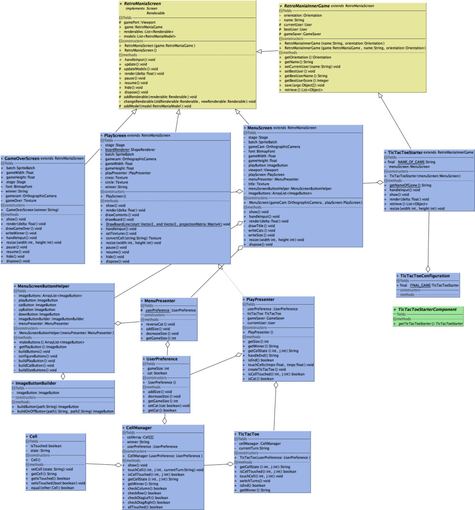

# retromania
This is an android game my team members and I made for CSC207.  
I was responsible for the TicTacToe minigame in the application. 
This application uses the LibGDX framework.
Although it is a simple game, it implements the MVP model, 
has little coupling and has clear parent child relationships between classes.
This can be seen through the following UML diagram that represents my TicTacToe game code.

